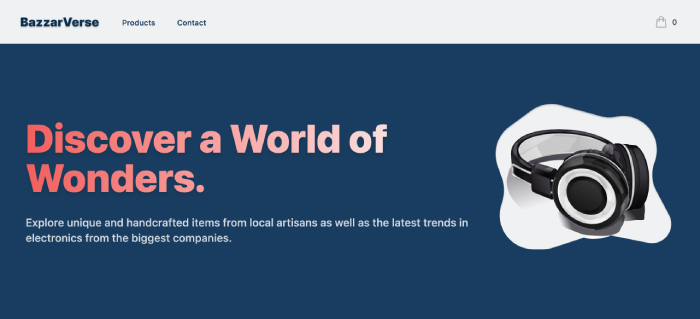
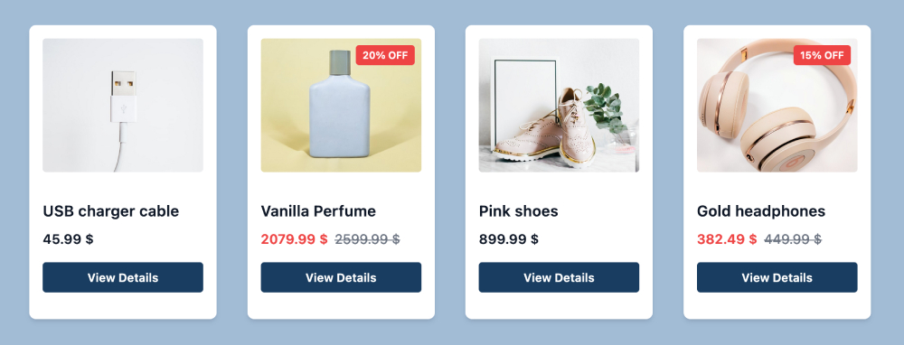

# BazaarVerce 🛍️



[](https://reactjs.org/)
[](https://redux.js.org/)
[](https://tailwindcss.com/)
[](https://developer.mozilla.org/en-US/docs/Web/HTML)
[](https://vitejs.dev/)


Discover a world of wonders with BazaarVerse, a React and Redux based e-commerce website project, using the API from Noroff. The website contains the following pages:

- Homepage 🏠: displays a list of all the products and has a look-ahead search bar that filters products.
- Cart page 🛒: displays all the products in the cart and a total amount. Clicking the Checkout button takes the user to the Checkout success page.
- Individual product page 🛍️: displays data for a single product, including title, description, and image. The page also shows reviews for the product, if any.
- Checkout success page 🎉: displays a message notifying the user that their order was successful, with a link back to the store.
- Contact page 📞: contains a contact form with form validation.

The website uses React Router to switch between pages, and a <Layout> component that contains a header and footer. The header includes a nav bar and a cart icon component that displays the number of items in the cart.

## Getting Started 🚀

To get started with this project, first clone the repository and install dependencies:

```

$ git clone git@github.com:Liisagrant/CA-react-BazaarVerse.git
$ cd CA-react-BazaarVerse
$ npm install

```

## License 📝

This project is licensed under the MIT License.

## Fun Joke 😂

Why do programmers prefer dark mode? Because light attracts bugs! 🐛 

Take Care❤️



